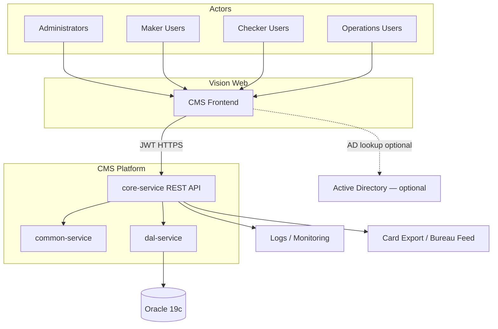
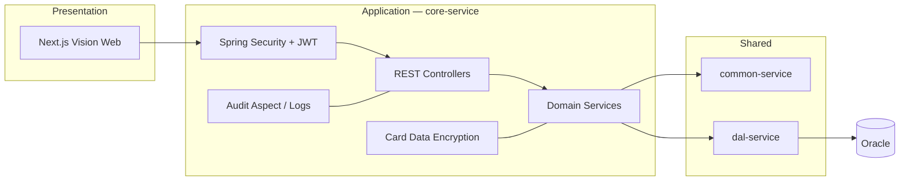
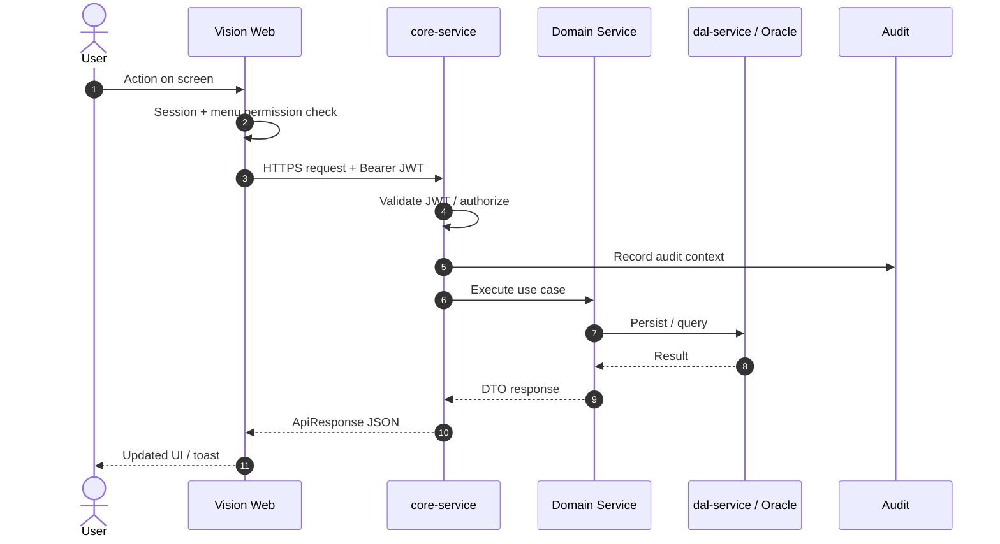
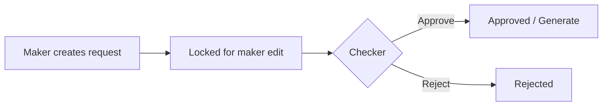
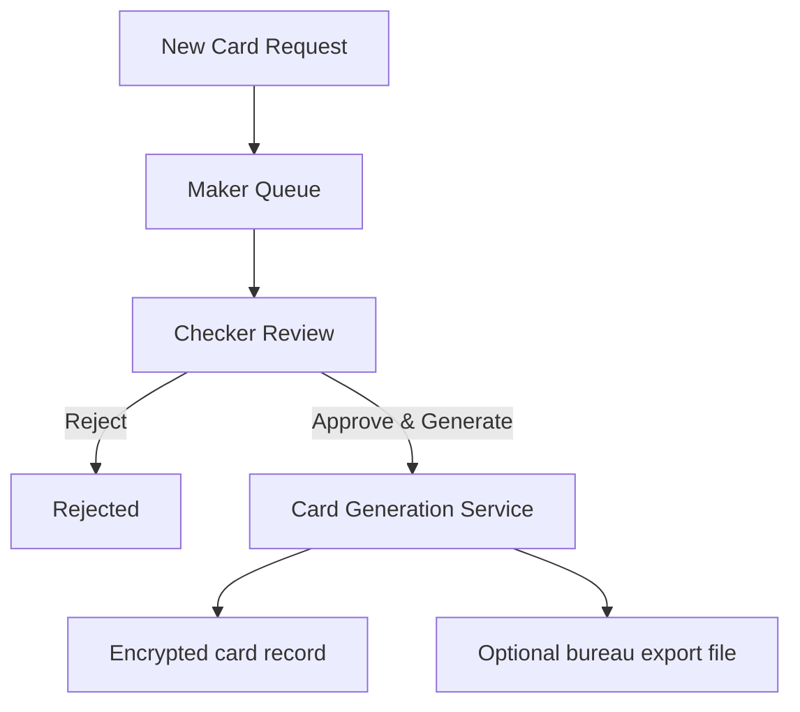
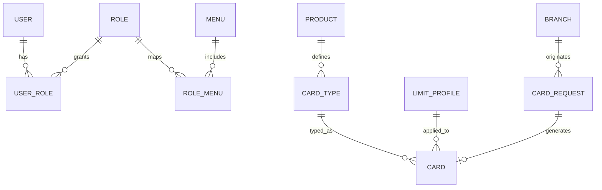

# Technical Specification Document (TSD)

# Card Management System (CMS) — Vision Web

| | |
|---|---|
| **Document Title** | Card Management System (CMS) / Vision Web — Technical Specification |
| **Document ID** | CMS-TSD-001 |
| **Version** | 1.0 |
| **Status** | Draft — Client Ready |
| **Classification** | Confidential |
| **Prepared For** | Client Delivery |
| **Prepared By** | Karsaaz — CMS Delivery Team |
| **Last Updated** | July 2026 |

---

## Document control

### Version history

| Version | Date | Author | Description |
|---------|------|--------|-------------|
| 0.1 | Jul 2026 | CMS Team | Initial draft structure |
| 1.0 | Jul 2026 | CMS Team | Full TSD — architecture, UI, security, APIs |

### Approvals

| Role | Name | Signature | Date |
|------|------|-----------|------|
| Project Manager | | | |
| Technical Lead | | | |
| Client Representative | | | |

### Related documents

| Document | Description |
|----------|-------------|
| `cms-frontend/docs/UI_GUIDELINES.md` | Frontend UI standards |
| `docs/JWT-EXAMPLE.md` | JWT authentication examples |
| `docs/ORACLE_DB_VERIFICATION.md` | Oracle setup verification |
| OpenAPI / Swagger | Live API docs at `/swagger-ui.html` |

### Screenshot folder convention

Place all UI captures in:

```text
tsd-screenshots/
├── 01-login/
├── 02-dashboard/
├── 03-security/
├── 04-housekeeping/
├── 05-card-configuration/
├── 06-limit-profiles/
├── 07-operations/
├── 08-card-production/
├── 09-monitoring/          (if applicable)
└── 10-flows/
```

**Naming rule:** `NN_ScreenName_View.png`  
Examples: `01_Login.png`, `04_Branches_List.png`, `04_Branches_Add.png`

In this document, every figure uses:

```markdown

```

> **Action for author:** After capturing screenshots, replace each placeholder path with the real file. Images will render in Markdown viewers and when converting to Word.

---

## Table of contents

1. [Purpose, scope & audience](#1-purpose-scope--audience)
2. [Glossary](#2-glossary)
3. [System overview](#3-system-overview)
4. [Technical architecture](#4-technical-architecture)
5. [Technology stack](#5-technology-stack)
6. [Non-functional requirements](#6-non-functional-requirements)
7. [Security specification](#7-security-specification)
8. [Vision Web — UI functional specification](#8-vision-web--ui-functional-specification)
9. [Data specification](#9-data-specification)
10. [API specification](#10-api-specification)
11. [Integrations](#11-integrations)
12. [Configuration & environments](#12-configuration--environments)
13. [Build, deployment & operations](#13-build-deployment--operations)
14. [Testing strategy](#14-testing-strategy)
15. [Error handling & logging](#15-error-handling--logging)
16. [Open items / roadmap](#16-open-items--roadmap)
17. [Appendices](#17-appendices)
18. [Claude prompt — Word document design](#18-claude-prompt--word-document-design)

---

## 1. Purpose, scope & audience

### 1.1 Purpose

This Technical Specification Document (TSD) defines how the **Card Management System (CMS)** — branded as **Vision Web** for Card Production, Monitoring, and Administration — is designed, secured, configured, and operated.

It is the single reference for:

- Client stakeholders reviewing solution capability
- Developers implementing and maintaining the platform
- QA preparing test cases from UI and API behaviour
- Operations deploying and supporting the system

### 1.2 In scope

| Area | Included |
|------|----------|
| Vision Web UI (Next.js frontend) | Yes |
| CMS REST API (`core-service`) | Yes |
| Shared libraries (`common-service`) | Yes |
| Data access layer (`dal-service`) | Yes |
| Oracle 19c persistence & Flyway | Yes |
| Security (JWT, roles, menus, permissions) | Yes |
| Card production, operations, housekeeping | Yes |
| Audit logging & PAN protection controls | Yes |

### 1.3 Out of scope

| Area | Reason |
|------|--------|
| External card personalization bureau hardware | Client/site-specific |
| Core banking host internals | Integration boundary only |
| Network / firewall design | Infrastructure team |

### 1.4 Audience

| Audience | Use of this document |
|----------|----------------------|
| Client / business | Capability confirmation, UI walkthrough |
| Architects | Architecture & security decisions |
| Developers | Implementation contracts |
| QA | Screen & API test basis |
| DevOps | Deploy & config matrix |

### 1.5 Assumptions & constraints

- Java **21**, Spring Boot **3.2.x**, Oracle **19c**
- Frontend served as Next.js application (static export capable)
- Authentication via JWT; HTTPS required in production
- Card data at rest encrypted (AES-256-GCM); PAN display masked by default
- No secrets (DB passwords, JWT keys, encryption keys) stored in source control

---

## 2. Glossary

| Term | Meaning |
|------|---------|
| CMS | Card Management System |
| Vision Web | Web UI for CMS — production, monitoring, administration |
| PAN | Primary Account Number (card number) |
| BIN / IMD | Bank Identification Number / Issuer Identification |
| JWT | JSON Web Token used for API authentication |
| Maker–Checker | Dual-control approval workflow |
| Housekeeping | Reference / setup data maintenance |
| Limit Profile | ATM / POS / E-commerce limit configuration |
| Flyway | Database migration tool |
| BLR | Business Logic Rule (where applicable in core/common) |
| AD | Active Directory (optional enterprise user source) |

---

## 3. System overview

### 3.1 Product description

**Vision Web** is the upgraded web interface for CMS. It provides:

1. **Card Production** — new card requests, maker/checker queues, generation  
2. **Operations** — card search, status/type change, replacement, export, expiry  
3. **Administration** — security (users, roles, menus, permissions), housekeeping setup, products, card types, limit profiles  
4. **Monitoring** — dashboard queues and operational visibility for connected processing (extensible to live transaction monitoring)

### 3.2 High-level capabilities

```text
┌─────────────────────────────────────────────────────────────────┐
│                        VISION WEB (UI)                          │
│  Login · Dashboard · Security · Housekeeping · Operations       │
│  Card Production · Limit Profiles · Audit                       │
└────────────────────────────┬────────────────────────────────────┘
                             │ HTTPS + JWT
┌────────────────────────────▼────────────────────────────────────┐
│                     CMS BACKEND (core-service)                  │
│  REST Controllers · Services · Auth · Encryption · Audit        │
└──────────────┬─────────────────────────────┬────────────────────┘
               │                             │
     ┌─────────▼─────────┐         ┌─────────▼─────────┐
     │  common-service   │         │   dal-service     │
     │  Security helpers │         │  JPA / Entities   │
     │  Shared utilities │         │  Repositories     │
     └───────────────────┘         └─────────┬─────────┘
                                             │
                                   ┌─────────▼─────────┐
                                   │   Oracle 19c      │
                                   └───────────────────┘
```

### 3.3 System context diagram



### 3.4 Users & roles (logical)

| Persona | Typical access |
|---------|----------------|
| System Administrator | Security, menus, permissions, housekeeping |
| Maker | Create card requests; view own queue |
| Checker | Approve / reject card requests |
| Card Operations | Cards, status, type, replacement, export |
| Auditor | Audit logs (read) |

Exact screen access is controlled by **roles → menus / permissions**.

---

## 4. Technical architecture

### 4.1 Runtime modules (in use)

| Module | Role |
|--------|------|
| **`cms-frontend`** | Vision Web UI — Next.js + TypeScript + PrimeReact |
| **`core-service`** | Spring Boot application — REST API, business services, auth, encryption, schedulers |
| **`common-service`** | Shared security/config utilities used by core |
| **`dal-service`** | JPA entities and Spring Data repositories |

Runtime dependency chain: `core-service` → `common-service` → `dal-service`.

### 4.2 Logical architecture



### 4.3 Request flow



### 4.4 Frontend structure

| Area | Path prefix | Purpose |
|------|-------------|---------|
| Auth | `/auth/login/` | Login |
| Home | `/` | Dashboard |
| Security | `/security/` | Users, roles, menus, permissions, audit |
| Housekeeping | `/housekeeping/` | Setup / reference data |
| Operations | `/operations/` | Card lifecycle operations |
| Card Production | `/card-production/` | Requests & generation |

Menus may be enriched from API (`/api/my-menus` or role–menu mapping) and categorized in UI as Security, Operations, Card Production, Housekeeping.

### 4.5 Design principles

- Thin UI, thick API — business rules enforced on server  
- Parameterized data access — no string-concatenated SQL with user input  
- Least privilege — role/menu based access  
- Defence in depth — JWT + encryption at rest + PAN masking + audit  
- Consistent UI patterns — shared dialogs, forms, confirmations  

---

## 5. Technology stack

| Layer | Technology | Version / notes |
|-------|------------|-----------------|
| UI | Next.js, React, TypeScript | PrimeReact (Sakai-based) |
| UI state / data | TanStack Query | Client data fetching |
| API | Spring Boot | 3.2.x |
| Language | Java | 21 |
| Security | Spring Security + JJWT | Bearer tokens |
| Persistence | Spring Data JPA | `ddl-auto=none` |
| DB | Oracle 19c | Production |
| Migrations | Flyway | Under `core-service` resources |
| API docs | springdoc OpenAPI | `/swagger-ui.html` |
| Logging | SLF4J / Logback | ELK-ready |
| Containers | Docker Compose | Optional local/prod packaging |
| CI | GitHub Actions | Deploy workflows present |

---

## 6. Non-functional requirements

| Category | Requirement |
|----------|-------------|
| Availability | Support business-hours CMS operations; target agreed with client SLA |
| Performance | Interactive screens respond within acceptable UI time under normal load; list APIs paginated where applicable |
| Security | JWT auth; HTTPS in prod; encrypted card secrets; masked PAN in UI |
| Auditability | Security-relevant and card-production actions auditable |
| Maintainability | Modular Maven multi-module backend; typed frontend services |
| Compatibility | Modern evergreen browsers (Chrome / Edge / Firefox latest) |
| Scalability | Horizontal scale of API instances behind load balancer (stateless JWT) |
| Recoverability | DB backups per DBA policy; Flyway-versioned schema |

---

## 7. Security specification

### 7.1 Authentication

1. User opens Vision Web login.  
2. UI calls `POST /api/auth/login` with `loginId` + `password`.  
3. On success, API returns JWT + user profile.  
4. UI stores token and sends `Authorization: Bearer <token>` on subsequent calls.  
5. `POST /api/auth/refresh` renews token when supported.


**Login fields**

| Field | Required | Notes |
|-------|----------|-------|
| Login ID | Yes | Maps to `USM_USER` (or equivalent) |
| Password | Yes | Masked input |

### 7.2 Authorization (groups / roles)

Vision provides **group/role-based security**. Access to screens is granted to roles; users inherit rights from assigned roles.


**Typical role setup steps**

1. Enter unique Role / Group code  
2. Enter Role / Group name  
3. Mark Active  
4. Assign menu / permission checkboxes  
5. Optionally set home page based on permitted menus  
6. Assign users  
7. Save  

### 7.3 Users


**User fields (typical)**

| Field | Required | Notes |
|-------|----------|-------|
| Login ID / User Name | Yes | Unique |
| Full Name | Yes | |
| Email | Recommended | |
| Mobile | Optional | |
| Active | Yes | Inactive users cannot operate |
| Password | Yes on create | Policy via password expressions |
| Roles | Yes | One or more |

**Active Directory (target / bank-specific):** Where required (e.g. JS Bank), AD search can populate name/email from the corporate directory. Document AD endpoint and bind account in environment runbook — not in source code.

### 7.4 Menus & permissions


Menus define navigation paths and icons. Permissions gate actions (view, create, approve, unmask PAN, etc.).

### 7.5 PAN masking

- Default UI shows **masked PAN**: first 6 + last 4 digits.  
- Example: `555555******5555`  
- Permissions such as **PAN View Unmasked** and **PAN View Unmasked — Reports** may be assigned per role.  
- Card data at rest is encrypted (AES-256-GCM). Lookup may use salted hash.


### 7.6 Session timeout

- Idle session logout is configurable (industry default often **15 minutes**).  
- After timeout, user is returned to the login screen.  
- Configure timeout at application / database configuration level for the deployment.

### 7.7 Maker–Checker

Dual control is implemented for **Card Requests** (maker queue / checker queue / reject / approve-and-generate).

**Applicable / target areas**

| Entity | Maker–Checker |
|--------|----------------|
| Card Request | Implemented |
| Customer add/update | Target / extendable |
| Card update | Target / extendable |
| Account linking | Partial via card operations |
| User and Group | Target / policy-driven |
| Limit and Permission (with exception) | Target / policy-driven |




### 7.8 Secure logging

- Logs must not contain full PAN.  
- Preferred pattern: truncated PAN + cryptographic hash (e.g. SHA-512 / SHA-256 per component design).  
- Audit trail available via **Security → Audit Logs**.


### 7.9 Card encryption keys (ops)

| Setting | Purpose |
|---------|---------|
| `cms.card.encryption-key` / `CARD_ENCRYPTION_KEY` | AES-256 key |
| `cms.card.encryption-optional` | Prod should be `false` |
| `cms.card.hash-salt` | PAN hash salt for lookup |
| `cms.card.export.output-dir` | Bureau export directory (PCI: not served by API) |

---

## 8. Vision Web — UI functional specification

### 8.0 Navigation map


| Menu | Items |
|------|-------|
| Home | Dashboard |
| Security | Users, Roles, Menus, Permissions, Audit Logs |
| Operations | Cards, Expiry search, Change card type, Replacement request, Change card status, Card export |
| Card Production | New Card Request, Card Requests, Search Requests, Card Generation |
| Housekeeping | Branches, Account Statuses, Account Types, Policies, Password Expressions, Response Codes, Limit Profiles, Products, Card Types |

---

### 8.1 Dashboard

**Purpose:** Landing page after login — operational summary and maker/checker queues.


| Element | Description |
|---------|-------------|
| Summary widgets | Counts / status tiles (as implemented) |
| Checker queue | Requests awaiting approval |
| Maker queue | Requests created by makers |

---

### 8.2 System configuration (Housekeeping)

The Housekeeping module maintains setup data required by operational workflows.

#### 8.2.1 Branches

**Route:** `/housekeeping/branches/`  
**API:** `/api/branches`


**Steps — add branch**

1. Open **Housekeeping → Branches**  
2. Click **Add**  
3. Enter **Branch Code** (unique; fixed after create)  
4. Enter **Branch Name**  
5. Enter **City Code**, **Country Code**, **SWIFT Code** as required  
6. Click **Save** (or **Cancel**)

| Field | Type | Required |
|-------|------|----------|
| Branch Code | Text | Yes |
| Branch Name | Text | Recommended |
| City Code | Text | Optional |
| Country Code | Text | Optional |
| SWIFT Code | Text | Optional |

#### 8.2.2 Account types

**Route:** `/housekeeping/account-types/` · **API:** `/api/account-types`


| Field | Required |
|-------|----------|
| Code (`acctTypeCode`) | Yes |
| Name (`acctTypeName`) | Yes |

#### 8.2.3 Account statuses

**Route:** `/housekeeping/account-statuses/` · **API:** `/api/account-statuses`


| Field | Required |
|-------|----------|
| Code | Yes |
| Name | Yes |
| Description | Optional |

#### 8.2.4 Policies

**Route:** `/housekeeping/policies/` · **API:** `/api/policies`


| Field | Required |
|-------|----------|
| Policy ID | Yes |
| Name | Recommended |
| Description | Optional |

#### 8.2.5 Password expressions

**Route:** `/housekeeping/password-expressions/` · **API:** `/api/password-expressions`


Used to define password complexity rules for system users.

#### 8.2.6 Response codes

**Route:** `/housekeeping/response-codes/` · **API:** `/api/response-codes`


| Field | Required |
|-------|----------|
| Code | Yes |
| Short Description | Recommended |
| Full Description | Optional |

#### 8.2.7 Additional housekeeping (API-ready / roadmap UI)

The platform APIs also support broader reference data (banks, cities, countries, currencies, customer types, nationalities, channels, device types, etc.). Screens may be added under Housekeeping using the same CRUD pattern.

| Setup item (Vision classic) | CMS status |
|-----------------------------|------------|
| Customer Types | API / extend UI |
| Cities / Nationalities / Banks | API / extend UI |
| Utility Companies | Roadmap |
| Denomination | Roadmap |
| Terminal Type | Roadmap |

---

### 8.3 Card configuration

#### 8.3.1 Card product

**Purpose:** Define debit card products (e.g. PAYPAK, VISA, MasterCard).

**Route:** `/housekeeping/products/` · **API:** `/api/products`


**Steps — define new card product**

1. Enter **Product Code**  
2. Enter **Product Name** (e.g. VISA Debit)  
3. Select **Is Active**  
4. Click **Save**

| Field | Type | Required |
|-------|------|----------|
| Product Code | Text | Yes |
| Product Name | Text | Yes |
| Is Active | Checkbox | Yes |

#### 8.3.2 Card type / program configuration

**Purpose:** Define card types linked to a product (program-level configuration).

**Route:** `/housekeeping/card-types/` · **API:** `/api/card-types`


**Steps**

1. Enter **Card Type Code**  
2. Enter **Card Type Name**  
3. Select **Product** from dropdown  
4. Select **Is Active**  
5. Click **Save**

| Field | Type | Required |
|-------|------|----------|
| Card Type Code | Text | Yes |
| Card Type Name | Text | Yes |
| Product | Dropdown | Yes |
| Is Active | Checkbox | Yes |

**Extended program fields (Vision target — document when enabled in UI):**

| Field | Description |
|-------|-------------|
| PAN Length | Length of generated PAN |
| BIN | Bank Identification Number |
| Account Range | Active range indicator |
| Service Code | ISO service code |


---

### 8.4 Limit profile

**Purpose:** Maintain transactional limits (ATM, POS, E-commerce — daily / monthly / yearly). Profiles can be applied in card operations (card-based limit association). Account- and customer-based limit strategies are supported conceptually and can be extended.

**Route:** `/housekeeping/limit-profiles/` · **API:** `/api/limit-profiles`


**Steps**

1. Enter **Profile Code** and **Profile Name**  
2. Enter **Currency Code**  
3. Enter ATM / POS / E-commerce daily, monthly, yearly amounts  
4. Mark **Active**  
5. Save  

| Field | Notes |
|-------|-------|
| profileCode | Unique |
| profileName | Display name |
| currencyCode | e.g. PKR |
| atmDailyAmount / Monthly / Yearly | ATM limits |
| posDailyAmount / Monthly / Yearly | POS limits |
| ecommerceDailyAmount / Monthly / Yearly | E-com limits |
| active | Enable/disable profile |

**Limit dimensions**

| Dimension | Description |
|-----------|-------------|
| Card-based | Profile linked to card |
| Account-based | Profile linked to account (extend) |
| Customer-based | Profile linked to customer (extend) |

---

### 8.5 Operations — Cards

#### 8.5.1 Cards list & detail

**Routes:** `/operations/cards/`, `/operations/cards/detail/?id=`


Capabilities include view card, set limit profile, link/delink account, update attributes (per permissions).

#### 8.5.2 Expiry search

**Route:** `/operations/cards/expiry/`


Search cards by expiry criteria / PAN fragment (masked results).

#### 8.5.3 Change card type

**Route:** `/operations/cards/change-type/`


#### 8.5.4 Replacement request

**Route:** `/operations/cards/replacement-request/`


#### 8.5.5 Change card status

**Route:** `/operations/cards/change-status/`


#### 8.5.6 Card export

**Route:** `/operations/cards/export/`


Bulk export / renew flows as exposed by API (`/api/cards/bulk-export`, `/api/cards/bulk-renew`, export-ready).

---

### 8.6 Card production

#### 8.6.1 New card request

**Route:** `/card-production/new-request/` · **API:** `POST /api/card-requests`


**Typical steps**

1. Enter relationship / customer lookup  
2. Confirm customer information returned by API  
3. Select product / card type / branch as required  
4. Submit request (Maker)  
5. Request appears in maker queue; checker processes approval  

#### 8.6.2 Card requests (maker / checker)

**Route:** `/card-production/requests/`  
**APIs:** `/api/card-requests/maker`, `/api/card-requests/checker`, reject, update


#### 8.6.3 Search requests

**Route:** `/card-production/requests/search/`


Filters: relationship number, branch, processed flag, paging.

#### 8.6.4 Card generation

**Route:** `/card-production/generation/`  
**API:** `/api/card-generation/...` including approve-and-generate


On approval, system may generate card artifacts and optionally write bureau feed files to a secured output directory.




---

### 8.7 System monitoring (Vision capability)

**Vision Web target:** system monitoring for connected systems and **live monitoring** of transactions routed through the platform.


| Capability | Status |
|------------|--------|
| Dashboard queues | Available |
| Connected systems health | Roadmap / integration-specific |
| Live transaction monitor | Roadmap / integration-specific |

---

### 8.8 Common UI patterns

All create/edit screens follow shared components:

- Page title + short description  
- Toolbar primary action (**Add …**)  
- Data table with icon actions + tooltips  
- `AppDialog` for create/edit  
- `ConfirmActionDialog` for delete/reject  
- Toast for success/error  
- Required fields marked with asterisk  

Reference: `cms-frontend/docs/UI_GUIDELINES.md`

---

## 9. Data specification

### 9.1 Persistence approach

- Schema owned by **Flyway** scripts in `core-service`  
- JPA entities in **`dal-service`**  
- Hibernate DDL auto-update **disabled** in production (`none`)

### 9.2 Key domain areas (logical)

| Domain | Examples |
|--------|----------|
| Security | Users, roles/groups, permissions, menus, user–role links |
| Reference | Branches, account types/statuses, policies, response codes |
| Card config | Products, card types, limit profiles |
| Cards | Card master, links to accounts, status, type, limits |
| Production | Card requests, generation results, export metadata |
| Audit | Request/activity audit logs |

### 9.3 Sensitive data rules

| Data | Rule |
|------|------|
| PAN | Encrypted at rest; masked in UI; hashed for lookup |
| CVV / PIN-related | Never logged in clear; encrypt where stored |
| Passwords | Stored using approved hash algorithm — never reverseable |
| Export files | Written to secured directory; not downloadable via public API by default |

### 9.4 Data model overview



> Detailed column dictionary can be generated from Flyway `V1__*.sql` and attached as Appendix B for the client data pack.

---

## 10. API specification

### 10.1 Conventions

| Item | Convention |
|------|------------|
| Base URL | `https://<host>:8080` (or configured) |
| Auth | `Authorization: Bearer <jwt>` except login/health |
| Envelope | `ApiResponse<T>` with message + data |
| Docs | `/swagger-ui.html` |

### 10.2 API catalog (summary)

| Area | Base path | Ops |
|------|-----------|-----|
| Auth | `/api/auth/login`, `/api/auth/refresh` | POST |
| Users | `/api/users` | CRUD + roles |
| Roles | `/api/roles` | CRUD + menus |
| Permissions | `/api/permissions` | CRUD |
| Menus | `/api/menus`, `/api/my-menus` | CRUD / mine |
| Audit | `/api/audit-logs` | Read |
| Dashboard | `/api/dashboard` | Read |
| Branches | `/api/branches` | CRUD |
| Account types | `/api/account-types` | CRUD |
| Account statuses | `/api/account-statuses` | CRUD |
| Policies | `/api/policies` | CRUD |
| Password expressions | `/api/password-expressions` | CRUD |
| Response codes | `/api/response-codes` | CRUD |
| Products | `/api/products` | CRUD |
| Card types | `/api/card-types` | CRUD |
| Limit profiles | `/api/limit-profiles` | CRUD |
| Cards | `/api/cards` | Search, update, link, export, … |
| Card requests | `/api/card-requests` | Create, maker/checker, reject, search |
| Card generation | `/api/card-generation` | Process / approve-and-generate |
| Health | `/actuator/health` | No JWT |

### 10.3 Example — login

```http
POST /api/auth/login
Content-Type: application/json

{ "loginId": "admin", "password": "********" }
```

Response includes `token` used for subsequent calls.

---

## 11. Integrations

| System | Direction | Purpose |
|--------|-----------|---------|
| Oracle 19c | CMS ↔ DB | System of record |
| Active Directory | AD → CMS (optional) | Enterprise user lookup |
| Bureau / export folder | CMS → File | Card production output |
| ELK / log stack | CMS → Logs | Centralized monitoring |
| Connected hosts / switch | External ↔ CMS | Transaction routing / monitoring (roadmap) |

---

## 12. Configuration & environments

### 12.1 Key settings

| Setting | Purpose |
|---------|---------|
| `SPRING_DATASOURCE_URL` | Oracle JDBC URL |
| `SPRING_DATASOURCE_USERNAME` / `PASSWORD` | DB credentials |
| JWT secret / expiry | Token security |
| `app.cors.allowed-origins` | Frontend origins |
| `CARD_ENCRYPTION_KEY` | Card encryption |
| `NEXT_PUBLIC_API_BASE_URL` | Frontend → API URL |
| `cms.card.export.output-dir` | Export path |

### 12.2 Environments

| Env | UI | API | DB |
|-----|----|-----|-----|
| Development | localhost:3000 | localhost:8080 | Dev Oracle / local |
| Test / UAT | Client UAT host | UAT API | UAT Oracle |
| Production | Prod host | Prod API | Prod Oracle |

Secrets differ per environment; never commit `.env` with real credentials.

---

## 13. Build, deployment & operations

### 13.1 Backend

```bash
mvn clean install
cd core-service && mvn spring-boot:run
```

### 13.2 Frontend

```bash
cd cms-frontend
npm install
npm run dev
```

### 13.3 Docker (optional)

```bash
docker compose -p cms build
docker compose -p cms up -d
```

- Backend container: **CMS** (port 8080)  
- Frontend container: **CMS-Frontend** (port 3000)  
- Oracle is external — provide JDBC URL via env  

### 13.4 Operational checks

| Check | How |
|-------|-----|
| API up | `GET /actuator/health` |
| UI up | Open login page |
| Auth | Login + call `/api/users` with JWT |
| DB | Flyway history table / app logs |

---

## 14. Testing strategy

| Type | Scope |
|------|-------|
| Unit | Services / utilities in core & common |
| API integration | `ApiIntegrationTest` with H2 |
| Smoke | `scripts/api-smoke-test.sh` against running API |
| UI UAT | Screen scripts from Chapter 8 |
| Security | AuthZ negative tests, PAN masking, idle timeout |
| Regression | Card request maker–checker + generation |

**Entry criteria:** Build green, Flyway applied, test users seeded.  
**Exit criteria:** Critical UAT scripts passed; no Sev-1 open defects.

---

## 15. Error handling & logging

| Layer | Behaviour |
|-------|-----------|
| UI | Toast / inline validation; 401 → login |
| API | Consistent `ApiResponse` + HTTP status |
| Domain | Duplicate resource / unauthorized exceptions |
| Logs | No clear PAN; correlation-friendly messages |
| Audit | Security & production actions retained per policy |


---

## 16. Open items / roadmap

| Item | Priority | Notes |
|------|----------|-------|
| Full Vision housekeeping screens (banks, cities, …) | Medium | APIs largely present |
| PAN format / BIN / service code UI | High | Program config completeness |
| AD user search | High (bank-specific) | JS Bank style |
| Live transaction monitoring | High | Connected systems |
| Maker–checker on Users/Groups/Limits | Medium | Dual control expansion |
| Session timeout DB-driven config UI | Low | Ops config |

---

## 17. Appendices

### Appendix A — Screen inventory & screenshot checklist

| # | Module | Screen | Screenshot file | Captured? |
|---|--------|--------|-----------------|-----------|
| 1 | Auth | Login | `01-login/01_Login.png` | ☐ |
| 2 | Home | Dashboard | `02-dashboard/01_Dashboard.png` | ☐ |
| 3 | Home | App shell / menu | `02-dashboard/01_AppShell_Menu.png` | ☐ |
| 4 | Security | Users list / add | `03-security/03_Users_*.png` | ☐ |
| 5 | Security | Roles list / add | `03-security/02_Roles_*.png` | ☐ |
| 6 | Security | Menus | `03-security/04_Menus_List.png` | ☐ |
| 7 | Security | Permissions | `03-security/05_Permissions_List.png` | ☐ |
| 8 | Security | Audit logs | `03-security/06_AuditLogs.png` | ☐ |
| 9 | Housekeeping | Branches | `04-housekeeping/01_Branches_*.png` | ☐ |
| 10 | Housekeeping | Account types | `04-housekeeping/02_AccountTypes_*.png` | ☐ |
| 11 | Housekeeping | Account statuses | `04-housekeeping/03_AccountStatuses_*.png` | ☐ |
| 12 | Housekeeping | Policies | `04-housekeeping/04_Policies_List.png` | ☐ |
| 13 | Housekeeping | Password expressions | `04-housekeeping/05_PasswordExpressions_List.png` | ☐ |
| 14 | Housekeeping | Response codes | `04-housekeeping/06_ResponseCodes_List.png` | ☐ |
| 15 | Card config | Products | `05-card-configuration/01_Products_*.png` | ☐ |
| 16 | Card config | Card types | `05-card-configuration/02_CardTypes_*.png` | ☐ |
| 17 | Limits | Limit profiles | `06-limit-profiles/01_LimitProfiles_*.png` | ☐ |
| 18 | Operations | Cards / detail | `07-operations/01_*.png`, `02_*.png` | ☐ |
| 19 | Operations | Expiry / type / replacement / status / export | `07-operations/03–07_*.png` | ☐ |
| 20 | Production | New request / queues / search / generation | `08-card-production/*.png` | ☐ |
| 21 | Monitoring | Live monitor (if any) | `09-monitoring/01_*.png` | ☐ |
| 22 | Flows | Production flow collage | `10-flows/01_*.png` | ☐ |

### Appendix B — Module boundary (explicit)

```text
USED IN THIS CMS DELIVERY
─────────────────────────
cms-frontend
core-service
common-service
dal-service
Oracle 19c
```

### Appendix C — Quick smoke test script (manual)

1. Open UI → Login  
2. Open Dashboard — queues visible  
3. Housekeeping → Branches — create test branch → delete  
4. Products → create inactive test product → activate  
5. Card Types → link to product  
6. Limit Profiles → create profile  
7. New Card Request → appear in maker list  
8. Checker → reject or approve path (UAT data only)  
9. Cards list → confirm masked PAN  
10. Audit Logs → confirm entries  
11. Logout  

---

## 18. Claude prompt — Word document design

Copy everything inside the box below and paste it to Claude (or similar) **together with** `Technical.md` and your `tsd-screenshots` folder (or uploaded images).

````text
You are a professional technical writer and document designer for a fintech consulting company (Karsaaz).

TASK
Convert the attached Markdown file "Technical.md" (CMS / Vision Web Technical Specification Document) into a polished, client-ready Microsoft Word document (.docx).

DESIGN REQUIREMENTS
1. Page setup: A4, 2.5 cm margins, professional corporate look (clean blues/greys — NOT purple gradients, NOT playful fonts).
2. Cover page with:
   - Document title: "Card Management System (CMS) / Vision Web — Technical Specification"
   - Document ID CMS-TSD-001, Version, Date, Classification: Confidential
   - Company name: Karsaaz
   - Placeholder for client logo and company logo
3. Table of Contents (auto-generated field).
4. Heading styles:
   - Heading 1 = numbered chapters (1, 2, 3…)
   - Heading 2 / Heading 3 for subsections
5. Body text: Calibri or Segoe UI 11 pt; headings Calibri Light / Calibri Bold.
6. All Markdown tables → Word tables with header row shading (subtle navy/grey), thin borders, autofit window.
7. Keep ALL Mermaid diagrams:
   - Either render them as crisp images, OR
   - Recreate as Word SmartArt / shapes with the same meaning.
8. For every image placeholder like:
   
   - Insert the matching screenshot from the provided tsd-screenshots folder
   - Caption below image: “Figure X.Y — …” in italic 9–10 pt
   - Center images; max width ~15–16 cm; keep aspect ratio
   - If a screenshot file is missing, insert a grey placeholder box with the expected filename so the author can drop it later
9. Callout boxes for:
   - Security notes (PAN masking, encryption)
   - Roadmap items
10. Footer on every page: “CMS-TSD-001 | Confidential | Page X of Y”
11. Header: “Card Management System — Technical Specification”
12. Do NOT invent new product features. Stay faithful to Technical.md.
13. Do NOT include real passwords, keys, or live PANs.
14. Appendix A checklist should remain as a printable checkbox table.
15. After building the docx, provide a short “how to refresh TOC / update fields” note for Word.

OUTPUT
- Deliver a complete .docx
- If you cannot emit binary, give precise Pandoc / Python-docx instructions plus styled content blocks so I can generate it locally.
````

---

## End of document

**Next actions for the delivery team**

1. Create folder `tsd-screenshots/` with the subfolders listed in Document Control.  
2. Capture UI screenshots using Appendix A checklist (test data only).  
3. Drop files into the matching paths so Markdown figures resolve.  
4. Send `Technical.md` + screenshots + the Section 18 prompt to Claude to produce the client Word pack.  
5. Collect approvals in Document Control and freeze **v1.0**.

---

*© Karsaaz — Card Management System. Confidential. All rights reserved.*
